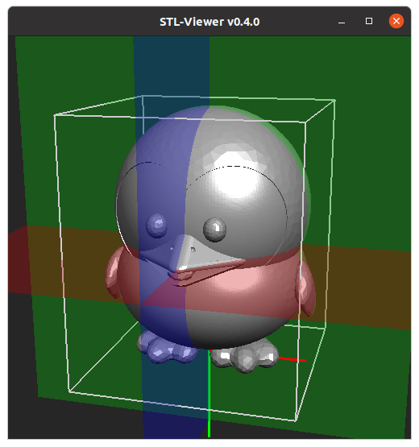

## STL-Viewer
simple STL File Viewer

usage: ./stlviewer file, ... 
example: ./stlviewer STL_data/baby-tux_bin.STL

--- Entwicklungsumgebung ---

- Linux Ubuntu 20.04.1
- gcc c++14
- OpenGL Version= 4.6 (Compatibility Profile) Mesa 21.0.3

---- Keyboard shortcuts ---- 
h : this message 
s : show special key's 
t : draw triangle ON/OFF 
l : draw line ON/OFF 
p : draw point ON/OFF 
e : Model einpassen (fit in) 
v : Vorderansicht

